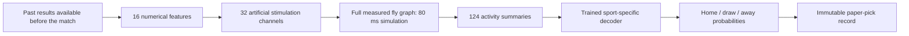

# How this fly works

**A guide to BET36FLY’s active v1 checkpoint and separate circuit experiments.**

For individual neurons, KC subtypes, APL, dopamine channels and MBON territories, use the [cell and circuit wiki](../wiki/index.md). Its [reassessment](../wiki/reassessment.md) records the unresolved learning mechanism at its dated checkpoint. The retained phase-1 code has since been integrated; the [current reward protocol](EXPERIMENT_REWARD.md) records that integration and its remaining scientific hold.

The fly really uses the measured fly connectome. Sports numbers stimulate neurons, spikes travel through the anatomical network, and a trained decoder turns the resulting activity into probabilities. Training changed a small subset of the actual connections. The first experiment works computationally, but **it does not yet predict games better than our simple statistical baseline**.

V1 remains the active model. The user paused v2 with 13 completed runs, eight cancelled temporal jobs and three unfinished whole-trial jobs. The bounded stronger-L2 diagnostic is summarized in the [tracked development evidence](evidence/v2-development-summary.md#decoder-diagnostics), using the existing frozen seed-42 responses and unchanged decoder. All 16 fits converged after the four C=0.01 reproduction checks passed. With stronger regularization, the selected temporal readout now slightly beats the selected whole-trial readout in both sports, but the simple feature baseline still has lower validation log loss. Selection used validation data, so this is development evidence rather than independent confirmation. It did not simulate the brain again, learn connection gains, resume the matrix or change a model pointer. The running app has passed desktop/mobile checks, documented in the [model card](MODEL_CARD.md#verification-and-acceptance), which is authoritative for current status, methods and results. This guide explains the active system and preserves its original training evidence. Read [confidence, draws and paper bet size](CONFIDENCE_AND_DRAWS.md) for the historical probability audit, and [the roadmap](ROADMAP.md) for future work.

## What came from Google and the research collaborators?

The starting point is **MaleCNS v1.0**, the released wiring dataset from HHMI Janelia, Google Research and collaborators. Our importer retains 166,700 annotated neuronal objects, 25,582,938 directed connections between neuron pairs, and 124,177,617 synaptic contacts. Multiple contacts between the same two neurons become one weighted connection. Unresolved fragments and non-neuronal objects are excluded; the import records their counts. The approximately 140,000-neuron female FlyWire brain is a different release. MaleCNS includes the ventral nerve cord as well as the brain. [Official dataset](https://male-cns.janelia.org/download/), [our source lock](connectome-source-lock.json).

A wiring dataset is not a pretrained sports model or a complete recording of a living fly's mind. It tells us which reconstructed neurons connect, with contact counts and annotations. We supply equations that determine how simulated cells react, an interface for sports observations, a learning procedure, and an output decoder.

Our independent C++ simulator uses leaky integrate-and-fire parameters from Shiu and colleagues' 2024 work. Their research evaluated sensorimotor processing; it did not demonstrate sports forecasting. Applying those parameters to this newer graph is our engineering experiment. [Shiu et al.](https://www.nature.com/articles/s41586-024-07763-9), [reference implementation](https://github.com/philshiu/Drosophila_brain_model).

## A neuron is not a weight

**A neuron is a computing unit; a weight describes the influence of a connection or transformation.** Comparing “166,700 fly neurons” with “billions of LLM weights” mixes two different counts.

| Concept | This simulated fly | A transformer language model |
| --- | --- | --- |
| Computing activity | Each cell has changing voltage and synaptic state; crossing a threshold emits a spike. | Numerical activations pass through attention and feed-forward transformations. |
| Weights | A connection's effect starts from contact count × transmitter sign × a scale; some receive learned gains. | Learned matrix entries determine transformations of token representations. |
| Structure | Sparse, recurrent wiring measured from one nervous system. | An architecture designed for processing sequences, with learned attention computations. |
| Time | Explicit 0.2 ms steps and delayed spikes during an 80 ms trial. | Sequence positions and successive computations; not biological milliseconds. |
| What is learned here | Selected connection gains and a sports decoder. | Commonly, predicting tokens during pretraining, with additional adaptation afterward. |
| Input/output | Sixteen numerical observations become stimulation; activity becomes three outcome probabilities. | Tokens become representations, then predictions over tokens. |

The transformer architecture comparison follows the original [Transformer paper](https://arxiv.org/abs/1706.03762); current implementations vary. For the distinction between text pretraining and using examples in a prompt without updating weights, see [Brown et al.](https://arxiv.org/abs/2005.14165). Our fly column describes [the actual simulator](../bet36fly/brain.py) and [learning code](../bet36fly/learning.py).

An LLM can change its answer when given new context while its trained weights stay fixed. That is different from updating those weights through training. Similarly, our fly responds differently to new sports features without learning new connection gains. Persistent knowledge in parameters, temporary computational state, and records in an external database are three distinct forms of memory.

They are similar in useful ways: both transform inputs using many interacting numerical operations; changing parameters changes the response; training uses errors to select parameter updates; both can fit misleading patterns and generalize badly. A larger activation or sharper probability is not evidence of understanding in either system.

The **simulated** fly is also much simpler than a biological fly. A cell here has a few state variables, not a detailed dendritic tree, receptor chemistry, metabolism or a lifetime of embodied learning. We approximate transmitter effects with coarse signs, including a documented fallback for 3,718 uncertain-sign neurons. The graph is biologically sourced; the physiology and learning are approximations. It would be wrong to infer a real fly's cognitive limits from this program's scores.

There is no sound conversion such as “one fly neuron equals 1,000 LLM parameters.” Nor do 124 million contact counts mean 124 million independently learned sports parameters: most contacts are aggregated into pairwise weights, and almost all those weights remain fixed in our experiment.

## What the fly actually receives

For each match, an external feature builder calculates 16 pregame quantities describing team Elo, recent form, win rate, games played, rest, score margins and sport. These use past results. The fly sees the resulting numbers, not team names, written previews, a browser, video, injuries, lineups, bookmaker odds or player statistics. [Feature implementation](../bet36fly/features.py), [data and timing](sports-data.md).

Each feature gets a positive and negative stimulation channel: 32 channels in total. They drive 32 real antennal-lobe projection neurons, or **ALPNs**, selected from the annotated catalog. This is an artificial way of presenting sports information through cells whose biological role is different. It is not evidence that those cells naturally represent Elo or football.

All 166,700 modeled cells advance during a trial. Not all fire: the trained historical pass averaged about 19,333 active cells and 154,456 spikes per trial. Spikes travel over the retained graph. The output consists of 97 mushroom-body output neuron (**MBON**) firing rates plus 27 averages by neuronal superclass. All ALPNs are excluded from those averages, so the decoder cannot simply read their stimulation back out.

The 124 output quantities are compressed summaries, not a readout of every cell's exact spike timing. That compression and the short trial are possible information bottlenecks worth testing.



Baseball disables the draw output. Soccer predicts the three match-result categories. The current pick is simply the category with the largest probability; it is not a selection based on offered betting value.

## Read the Observatory

The existing brain canvas now keeps anatomy visible during replay. Cyan triangles are sensory ALPNs, violet circles are Kenyon cells, amber diamonds are MBONs, light-gray squares are other annotated cells and muted-gray crosses have unknown categories. A white halo marks a recorded spike without replacing that category color. Ordinary connection lines are slate; rose lines belong to the supported KC→MBON region that plastic models may scale. Rose does not by itself mean a gain changed.

Use the legend checkboxes to show or hide populations and connection layers. Hover or focus an explanation button for a preview; activate it to pin the full text in a scrollable inspector. Close inspector or Escape dismisses it and returns keyboard focus to the original control, including after following a node’s connection links. Hover previews do not intercept clicks; pin an explanation to read or follow its source links. The named topics explain neurons, synapses, mushroom bodies, weights, signs, shared gains, firing and replay, with biological source links. They distinguish what the dataset supplies, what the program assumes and what remains unknown.

Point at a cell to preview its identity, or click/tap to pin its details. The Find displayed neuron field and Inspect neuron selector offer the same access by keyboard. A pinned cell shows its body ID, type, category, available annotations and recorded spike count for the selected time bin. Its incident-connection list opens contact counts, modeled signs, plastic support and source/target cells without having to point at a thin line. Unavailable metadata stays unavailable.

The positions are sampled somas: cell bodies. Straight lines display connectivity, not complete neuronal processes, and the projection is not a mushroom-body outline. The interface samples up to 2,500 cells with category coverage and up to 3,500 of the strongest eligible connections between sampled cells, requiring at least five contacts per displayed connection. Every retained cell and edge still participates in computation. Rotation, filtering and selection change only the view.

Watch brain runs the active frozen checkpoint for a fixture. Replay spikes and the timeline inspect its recorded 80 ms response; playback is slowed for visibility. Nothing is learning during replay, and the trace is not live biology. A connectome is not a saved animal’s complete memories or behavior. More visible or active neurons does not establish greater intelligence. The detailed [UI explanations](../web/src/brainExplainers.ts) are the source of truth for inspector prose; the [model card](MODEL_CARD.md) gives the numerical assumptions.

## Follow the v2 experiment in Training

Training also shows a separate **On-circuit reward learning** panel. Its [dopamine-association protocol](EXPERIMENT_REWARD.md) changes supported KC-to-MBON gains from actual KC/DAN spike timing, while keeping the task readout fixed. It compares true-outcome teaching with shuffled teaching and frozen gains. Select an arm to inspect scores, class confusion, measured gain curves and DAN activity; downloads preserve the underlying evidence. The integrated phase-1 candidate can feed raw dopamine-neuron spike counts into the timing rule; it has not passed the untaught-home guard and no schema-4 sports pilot has run. Historical schema-3 results retain their signed tonic-reference rule. The glomerular encoder presents each game as a pattern of active antennal-lobe glomeruli, the way an odor is presented to a real fly, and applies three recorded cell-type gains (labeled-line ALPN ports, reduced APL output, raised KC input) so that the lobe does not reverberate and the readout MBONs can respond. This experiment is an engineered associative-learning test, with KC activity still denser than in real flies and unmodeled receptor chemistry, not a reconstruction of biological reward-prediction error. [Current measured results](evidence/reward-v3-summary.md).

There is one Training tab. At its top, the experiment tracker identifies active v1 and shows the original 24 neural run slots: eight variants across three seeds. Eight unfinished temporal jobs were cancelled by a separate user instruction, then the three remaining whole-trial jobs were paused for a decoder-only diagnostic. All original rows remain visible, including the 13 completed results; unfinished work is not represented as completed. Select a row to inspect its actual state, parameter counts, validation loss, decoder and surrogate curves, retained plastic checkpoints, neural activity and saturation measurements, and downloadable artifacts. Queued and cancelled runs have no invented completed metrics. Cancellation records the user’s execution decision; it is not a model score or a failed-run diagnosis. A failed run displays its stored error, and a fetch failure retains the last loaded results with a warning. The tracker polls every five seconds while jobs run and every thirty seconds otherwise.

Switch Comparison sport between soccer and baseball, then choose validation or the historical development benchmark. Validation determines the candidate; the January–August 2026 benchmark has already influenced this design. Comparisons fill from completed runs during execution, and the final comparison adds baselines, available-seed aggregates, the selected ensemble and paired weekly uncertainty intervals. No architecture currently has the three completed seeds needed for selection. Available results remain incomplete and descriptive; uncertainty over games does not supply missing seed replications. The [tracked decoder summary](evidence/v2-development-summary.md#decoder-diagnostics) records the original-grid and stronger-L2 results: temporal now has lower validation loss than whole, while both remain behind the feature baseline. This demonstrates sensitivity to regularization, not proof of a root cause or reliable improvement. Detailed reports remain local artifacts, and neither model promotion nor further grid expansion is automatic. The original v1 result remains a separately labeled archived reference below the tracker.

Shared learning uses 295 adjustable gains, one for each supplied KC-type/MBON-type pair with real supported edges. Independent learning uses 61,210. Whole readout averages activity across 80 ms; temporal readout preserves four consecutive 20 ms windows. Both still run the full graph. The [model card](MODEL_CARD.md#prespecified-v2-comparison-and-execution-amendment) explains the controlled comparisons and exact selection rule.

The Fresh games: prospective shadow panel reports a separate candidate after a completed selection. The current diagnostic does not select or activate one. It averages three full-simulator predictions, records them alongside a frozen feature-logistic baseline and keeps v1 active. Only eligible pregame forecasts can count. The first fixed readout awaits 100 completed eligible soccer fixtures and 1,000 baseball fixtures; interim metrics remain descriptive and empty future cohorts are honestly pending. Once a cohort is chosen its membership stays fixed, but corrected results and eligibility are rechecked. Invalidated members are excluded and shown explicitly, without replacement by later games. Public source refresh drives this workflow while the server runs, without online training or automatic promotion.

## How the active v1 checkpoint was trained

The first completed run is `20260910T232621Z`. It ran on CPU in **676 seconds, about 11.3 minutes**, including two complete passes through the full network for 8,075 historical examples. No Hugging Face credits, remote GPU, LLM or private API key was needed.

### 1. Make a chronological learning problem

| Partition | Period | Soccer | Baseball | Purpose |
| --- | --- | ---: | ---: | --- |
| Training | Available history before July 2025 | 760 | 3,687 | Fit scaling, connection gains and decoders. |
| Validation | July–December 2025 | 186 | 1,165 | Select epochs and baseline regularization. |
| Original v1 test; now historical development benchmark | January–August 2026 | 214 | 2,063 | Preserve the original result; do not select v2 candidates using this period. |

Soccer history starts in the 2023/24 EPL season; baseball history starts in 2024. Features update at a UTC day boundary after a conservative delay of at least 48 hours from scheduled start. Known resumed MLB games without reliable completion timing are excluded from labeled examples. This reduces leakage from late finishes and doubleheaders, but retrospective downloads can still contain corrections whose original publication times are unknown.

Training-only means and standard deviations scale the inputs. Extreme scaled values are clipped to the configured range. Validation and test outcomes do not fit those statistics. The exact selected game rows and split masks are frozen with the run.

### 2. Record the initial brain's responses

Every example is presented to the unmodified graph. Each trial resets neural state and uses seed 42, with the same deterministic random-number procedure for the Poisson stimulus. We record the actual firing responses and Kenyon-cell activity. **Kenyon cells**, or KCs, are the source population for the connections selected for learning.

Resetting matters: game B does not inherit game A's transient voltage state. Past results influence B through its externally calculated features, not through the fly remembering a previous trial.

### 3. Learn gains on existing anatomical connections

The trainable region contains **61,210 existing KC→MBON connections** between 4,064 KCs and 97 MBONs. A supervised, differentiable rate approximation estimates how gain changes would affect the decoder's task loss. This is the training **surrogate**.

Each supported connection receives a positive gain:

```text
gain = exp(0.3 × tanh(trainable_log_gain))
new_connection_weight = original_connection_weight × gain
```

The bound is approximately 0.741–1.350. It preserves each original sign and does not add connections. Unsupported positions in the storage array do not become edges.

We ran 60 epochs with Adam, learning rate 0.018, shuffled batches of up to 256, a penalty discouraging excessive gain changes, and gradient clipping. Loss averages the available sport-specific cross-entropies, so the larger baseball dataset does not dominate solely through its size. **Draws receive no special extra class weight.** Validation selected epoch 4. All 61,210 supported gains changed; selected gains ranged from 0.8151 to 1.0812.

This v1 procedure is supervised learning from known historical outcomes. V1 has no dopamine reward circuit, pleasure signal for winning, biological reinforcement rule, or exact differentiation through the full spiking simulator. Its surrogate is an approximation that may learn changes that transfer imperfectly to the real simulation. The separate reward engine now implements a spike-timing-dependent dopamine proxy; it does not replace v1.

That omission in v1 is an implementation choice, not a claim that flies lack reward learning. Dopamine modulates learning at Kenyon-cell-to-MBON synapses, and published mushroom-body models implement reinforcement-dependent synaptic updates. The new experiment changes the circuit's learning mechanism. Its specified teaching pulses and anatomical targets are tested; measured receptor effects and biological reward-prediction error remain unimplemented. [Bennett et al., 2021](https://www.nature.com/articles/s41467-021-22592-4).

### 4. Install the changes in the real graph and run it again

The learned gains are installed on those actual edges. The complete spiking network is rerun for all 8,075 examples. Its measured output changes: mean absolute change in the recorded readout was 5.04 in its firing-rate units.

This second pass is essential. Predictions are ultimately trained and served from the changed **full spiking graph**, not from the faster surrogate's predictions.

### 5. Fit the final decoder and freeze the checkpoint

The final decoder uses `log1p` of measured firing rates, with scaling fitted only on training examples. It has separate soccer and baseball linear heads followed by softmax. Its arrays allocate 750 coefficients and biases; the baseball draw head is masked and does not contribute predictions.

It ran 180 full-batch epochs with AdamW, learning rate 0.025, weight decay 0.03 and gradient clipping. Validation selected epoch 27. The saved checkpoint contains connection gains, feature/readout scaling, and the final decoder arrays. Its SHA256 is:

```text
3b6e7312cc4be07a354df4ff377bd6a05fb3af67effe6b86c67bedfa25bcf76e
```

Code: [experiment orchestration](../bet36fly/experiment.py), [training equations](../bet36fly/learning.py), [neural simulator](../bet36fly/lif.cpp). The run report and split manifest are local artifacts under `output/runs/`; large run files are excluded from Git.

## What the historical v1 result established

We know the network runs, the selected anatomical weights changed, those changes affect spiking responses, and its wiring affects the final probabilities. Silencing the graph changes output probabilities substantially. These establish a functioning, causally used neural component.

We do **not** yet know that this anatomy gives useful sports-prediction advantages.

| Held-out metric | Soccer fly | Soccer feature baseline | Baseball fly | Baseball feature baseline |
| --- | ---: | ---: | ---: | ---: |
| Accuracy, higher is better | 37.4% | 44.9% | 52.1% | 54.0% |
| Log loss, lower is better | 1.189 | 1.062 | 0.700 | 0.686 |
| Brier score, lower is better | 0.707 | 0.645 | 0.506 | 0.493 |
| Top-choice calibration error, lower is better | 0.209 | 0.105 | 0.047 | 0.020 |

The feature baseline is logistic regression using the same pregame information. It beats the fly in both sports on these metrics. Learned wiring also did not consistently improve on the frozen-brain control. More firing, more changed weights and attractive visualization are not substitutes for improved held-out results.

Our existing shuffled-label control shuffles only the final decoder's training labels: its wiring was already trained on true labels. It is not a shuffle of the entire learning pipeline. Likewise, silencing the graph proves dependence but does not show an advantage over equally large random wiring. The v2 protocol includes matched randomized controls for frozen-temporal and shared-temporal variants, but the user’s later curtailment leaves only seed 42 completed for those controls. Those partial comparisons do not deliver the original three-seed topology test or establish a general verdict on biological anatomy.

## Does it keep learning while we watch?

**No.** Refreshing fetches games and computes predictions with the frozen checkpoint. Updating past-result features changes what the model receives; it does not update neural weights. The ledger stores proposals, and replay displays recorded simulated activity. Neither operation is training.

The first version already has a modest kind of external memory: historical results, derived team statistics, saved parameters and a durable prediction ledger. Fly’s desk now matches eligible pregame picks to confirmed final scores and charts its record, with public source refresh every 15 minutes while the server runs. It does not yet retrieve analogous games, consult general sports knowledge, settle outcomes into a learning loop, or adjust its own parameters online.

That separation is useful for the next experiment. We can measure a fixed model's forecasts before deciding whether an explicitly versioned replacement is better. [The roadmap](ROADMAP.md) describes how to add memory and learning without losing that comparison.
