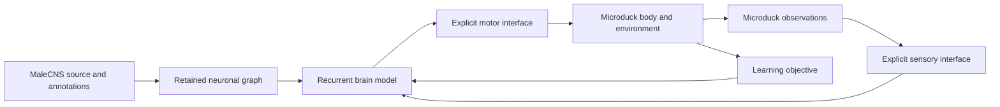

# Connectome: the nervous system that will control Microduck

[Wiki home](../index.md) · [Source ledger](sources.md)

Verified against live primary sources on **September 11, 2026 America/Denver** (September 12 UTC). This section is a research and implementation contract, not a record of completed robot training.

## The intended experiment

Microduck is the body. A fresh MaleCNS-derived recurrent network is the controller. Robot observations enter that network, its activity produces robot actions, and the consequences return as observations. Both duck body skills and the fly controller may be trained using real GPUs. Training can be staged or joint. The coupling and deployment architecture must make clear what the fly controls, what a learned body controller handles, and how body feedback reaches the fly; a fly used only as an offline teacher is different from a fly given a body at runtime.

The scientific opportunity is concrete: use measured neuronal identities and connectivity as the persistent computational substrate for learning a new body's control. Neither a downloaded graph nor a moving simulator alone establishes that outcome. We need provenance, a traceable runtime action path, and interventions showing that the neural network actually matters.

## Reading paths

| Question | Page | Result to carry forward |
|---|---|---|
| What exactly did Google and collaborators release? | [MaleCNS identity and provenance](malecns-release.md) | Separate dataset release, paper publication, biological coverage, and local graph counts. |
| Has a connectome already controlled a body? | [Embodiment research](embodiment-research.md) | Separate learned graph policies, simplified brain simulations, and body controllers. |
| How does that become Microduck's brain? | [Brain–body interface contract](brain-body-interface.md) | Require causal control through the graph and explicit engineered interfaces. |
| Which claims are verified, disputed, or incomplete? | [Primary-source ledger](sources.md) | Original sources, access dates, reproduction limits, and unresolved discrepancies. |

## Three distinct meanings of “real”

1. **Real anatomical source:** neuron IDs and synaptic contacts come from a reconstructed animal, with source versions and hashes.
2. **Real executing controller:** the retained network participates causally in every relevant action, on the claimed compute device, with observable state and reproducible checkpoints.
3. **Real biological fidelity:** neural dynamics and responses agree with biological measurements that were not used to tune the model.

The project can establish the first two without claiming the third. It should not weaken its actual ambition merely because anatomical fidelity does not establish complete biological emulation. Conversely, robot task performance cannot by itself establish native fly cognition or individual preservation.

## Knowledge graph

The diagram states the target architecture. Current implementation gaps and proposed acceptance tests are in the [interface contract](brain-body-interface.md); comparison systems are in [embodiment research](embodiment-research.md).
