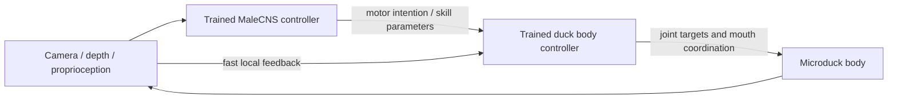

# Training both duck and fly, then giving the fly a body

## The user objective

Use real NVIDIA GPUs to train both the duck's control/skills and the fresh MaleCNS-derived fly controller. Couple them so Microduck serves as the fly's body. Preserve useful day-one movement skills, including rollers, while developing small-object pickup and deposit. Research must establish the architecture; a phrase such as “fly brain in a duck” does not specify which parameters learn or which component actuates the robot.

This page supersedes two earlier simplifications: making the fly only a teacher for an independent deployed duck model, and banning separate duck motor-skill training because the fly is embodied. Neither captures the latest instruction. A trained body controller can coexist with a trained fly controller. The scientific and engineering issue is their causal interaction.

## Four phases, separate identities

| Phase | What executes | What may change | Required record |
|---|---|---|---|
| Body-skill training | Microduck physics plus motor actor and training machinery | Motor policy, critic, normalization, curriculum | Observation/action contract, reward, trained checkpoint, actual GPU |
| Fly-controller training | MaleCNS-derived dynamics, sensory/readout adapters, body/environment feedback | Declared neural gains/dynamics/adapters and possibly other learned modules | Fixed vs trainable parameter map, graph identity, learned checkpoint, actual GPU |
| Coupling/refinement | Fly and body controller together in one feedback loop | Either one frozen, alternating updates, or both updated | Interface semantics, stability/generalization measurements, paired model versions |
| Physical deployment | Sensors, neural inference, body control, runtime arbitration, actuators | Usually inference state; online learning only if explicitly designed | Inference location, timing, fallback/reset behavior, exact model pair |

The [Microduck trainer](../microduck/trainer.md) provides the stock body-training infrastructure. [Embodiment research](../connectome/embodiment-research.md) supplies methods for neural/body coupling. [Compute](../compute/index.md) supplies training infrastructure. These are complementary sources, not interchangeable software packages.

## Hierarchical coupling

In a hierarchy, the fly can choose motion intentions, head/body configuration, or skill parameters while the body controller handles rapid balance and articulation. Both can be GPU-trained. A meaningful embodiment claim requires that the fly's outputs affect behavior and that resulting observations affect subsequent neural decisions. A fly activity display beside a policy driven entirely by another source is insufficient.

This option can reuse the [standard runtime](../microduck/runtime.md), but the available command interface must cover the task. Existing twist/head/body slots are not automatically a complete grasp/carry/release API. If a skill selector handles all task decisions while the fly emits irrelevant modulation, the attribution claim needs to reflect that. Hierarchy is a control decomposition, not permission to conceal control outside the brain.

## More integrated coupling

A connectome-derived controller can output joint-level actions, possibly with learned body adapters, local feedback mechanisms, and runtime bounds. That places more of balance and contact control in its learned dynamics. It demands a stronger export, timing, and learning integration than swapping an ONNX filename. The full graph may be represented as spiking dynamics, graded dynamics, or a connectome-constrained graph model; these are distinct assumptions to compare, not synonyms for the scanned nervous system.

[FlyGM](https://arxiv.org/html/2602.17997v1) is relevant because it turns connectome structure into a learned controller with input/output projections and trainable neural descriptors. Its reported procedure first imitates expert trajectories and then uses PPO. That direction teaches the graph from an expert; it is not the rejected idea of using a fly solely to train a separate deployed duck. However, its original body and dataset differ from Microduck/MaleCNS, and code availability is unresolved in the [research review](../connectome/embodiment-research.md). Its method is a reference, not an installed solution.

## Staged, alternating, and joint optimization

Staged training offers an interpretable baseline: establish reliable body skills, then train the fly to use them through feedback. Alternating updates can expand body capabilities while allowing the fly to adapt to a changing interface. Joint training can potentially coordinate both, but also makes failures harder to attribute and can let one module bypass another. These are design inferences. No reviewed source establishes which wins for the specific hazard-fetch task.

For each experiment, enumerate parameters and update rules by module. “End-to-end” must say whether gradients pass through the graph, how discontinuous spikes or contacts are handled, and whether the body policy changes. “Reward learning” must say where rewards arrive and which weights they update. A fixed graph can retain anatomical topology while learning gains, neural dynamics, or adapters; topology retention alone does not establish biological fidelity.

## Learning, inference state, and online adaptation

Learned parameters persist in checkpoints. Fast state—membrane values, recurrent hidden state, delayed events, traces—evolves during inference. These must not be confused. A network can show changing activity without learning. A reset can clear activity while preserving acquired parameters. Hardware deployment should explicitly state whether learning continues online or only inference occurs; neither follows automatically from GPU training.

The current local CPU kernel recreates fast state inside each simulation call. That behavior is appropriate for isolated trials but would need redesign or a different engine for a continuous controller. The local code has not been chosen as the final training engine. Fresh MaleCNS assets are ready; the [open questions](open-questions.md) separate data readiness from model readiness.

## Attribution tests

Compare the trained combination with body-only, fly-frozen, fly-disconnected, and matched alternative-controller conditions. Keep commands and evaluation conditions fair. A body-only baseline may still balance, which does not falsify the fly's role in navigation. Conversely, a catastrophic ablation that destroys all outputs proves dependence but not anatomy-specific benefit. Report task-level changes and relevant neural perturbations rather than interpreting every loss of motion as proof of a biological computation.

The design decision will follow small, reproducible GPU measurements of trainability, useful control authority, runtime fit, and task success. [Hazard evaluation](hazard-evaluation.md) defines what useful success must cover. This wiki does not declare that decision complete.

[Wiki index](../index.md) · [Connectome interface](../connectome/brain-body-interface.md) · [Runtime](../microduck/runtime.md).
