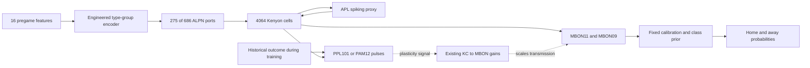

# Circuit and learning-rule contract

This page describes the integrated code and preserves the historical event-rule
contract. It is not biological validation. The corrected raw-event and bridge
rules both fail the second qualification panel. [Current evidence](reassessment.md).



The diagram selects relevant pathways, not the complete graph. The full recurrent network and other inputs to these cells remain. DAN fast transmission is suppressed; the dotted plasticity path is a separately implemented rule. The readout is not a natural motor output. [Circuit constructor](../bet36fly/reward_protocol.py).

## Shared electrical contract and historical event configuration

| Quantity | Setting | Meaning |
| --- | --- | --- |
| Integration step | 0.2 ms | Discrete event resolution |
| Membrane / synaptic decay | 20 / 5 ms | Uniform LIF constants |
| Threshold above rest | 7 mV | Rest/reset −52 mV, threshold −45 mV |
| Delay / refractory | 1.8 / 2.2 ms | Sensory ports are exempt from refractory delay |
| Base contact factor | 0.275 mV × global 0.5 | Before target/source gains and learned edge gain |
| Cell gains | ALPN input 0; KC input 1.25; APL output 0.25 | Explicit dynamics interventions |
| Trial / stimulus | 400 / 300 ms | No implied conversion to a real game's time |
| Plasticity onset / legacy reference window | 100 / 50 ms | Reference measured in [50,100) ms for tonic-baseline mode |
| Teaching times | 310, 330, 350, 370 ms | Training only |
| Trace time constant | 500 ms | KC and DAN event-history proxy |
| Learning rate / bounds | 0.0005 / [0.5,1.5] | Dimensionless multiplicative edge gains |

Sources: [frozen config](../configs/reward-v3-pilot.json), [native kernel](../bet36fly/reward_lif.cpp). Shiu's reference supplies the LIF foundation on female FlyWire; applying it to MaleCNS with these interventions does not reproduce the reference's sensorimotor experiments. [Shiu paper](https://www.nature.com/articles/s41586-024-07763-9), [inspected implementation](https://github.com/philshiu/Drosophila_brain_model/blob/91bdd1e7dcf193f3e7ca5a8933497fcef63b7960/model.py).

Incoming delayed events and instantaneous teaching pulses are discarded while
the target is refractory. They cannot accumulate and fire after release. The
local discrete release remains 11 steps (2.2 ms); exact-release input is accepted,
and ALPN sensory ports retain their zero-refractory behavior. After a spike the
engine resets voltage and conductance. These corrections follow the reference's
refractory clamp semantics; they are not a claim of identical Brian scheduling.
[Source contract and boundary tests](../docs/evidence/reward-refractory-contract-2026-09-12.md).

## Event and trace semantics

Let `K[t]` be a particular KC's binary spike event, and `D[t]` the selected DAN
population's spikes divided by its cell count in this step. Let `b` be its
estimated events-per-cell-per-step reference in historical tonic-baseline mode;
raw mode (`dan_reference: none`) uses `b = 0`. The event path first decays prior
traces, then applies:

```text
D_eff[t] = D[t] - b
delta_gain = eta * (D_trace * K[t] - K_trace * D_eff[t])
gain = clip(gain + delta_gain, lower, upper)
K_trace += K[t]
D_trace += D_eff[t]
```

The trace increments occur after the update. Thus the current event is not already inside the trace on the same step. The traces begin at the declared onset, not at the start of sensory presentation. Each trial resets voltages, synaptic state, pending events and traces; gains persist through the caller. Evaluation disables teaching and updates. [Kernel](../bet36fly/reward_lif.cpp), [wrapper](../bet36fly/reward_brain.py).

Subtraction is signed: if no DAN fires but `b > 0`, `D_eff` is negative. With
remaining KC eligibility, the depression term becomes potentiating. This is the
demonstrated post-offset artifact. Raw D removes that contribution; it does not
remove endogenous DAN events or make untaught learning neutral. Raw mode and
per-edge eligibility are now integrated. The
[pre-integration kernel snapshot](../docs/evidence/reassessment-2026-09-12/repair-reward_lif.cpp.txt)
remains historical evidence.

## Rate bridge: separately versioned signal integration

`learning_rule: rate-bridge-v1` requires raw D. It converts actual KC events and
population-mean DAN events into rate filters `R` with `tau_r = 100 ms` and
eligibility filters `E` with `tau_e = 500 ms`. All four states stay zero before
100 ms. At each active step, an event adds `1/tau_r` to its rate; eligibility
retains its prior value. The gain integrator then uses:

```text
r = 1/tau_r; e = 1/tau_e; n = 1 - (tau_r/tau_e)^2 = 0.96
Q = E_D * R_K - E_K * R_D
A = -expm1(-(r + e) * h) / (r + e)
attempted_delta = eta * n * A * Q
E_next = exp(-e*h)*E + R*(exp(-r*h) - exp(-e*h))/(e-r)
R_next = exp(-r*h)*R
```

Here `h = 0.2 ms` and `eta = 0.0005`. There is one time integral. A double
accumulator retains small changes within a trial; bounded float32 publication
controls subsequent transmission. At 400 ms, a separately recorded analytic
no-new-event tail applies `eta * n * Q_end / (r + e)` and publishes the final
checkpoint. This changes gains without extending neural time, spikes or membrane
state. Across calls only the float32 gains persist; filter states and the double
rounding remainder reset. Frozen plasticity uses effective eta zero, and masked
edges remain unchanged while transmitting.

Electrical and tail records separately retain attempted, bounded-double and
published-float changes. Inclusive bound observations include exact contact and
rounding to a bound, cumulative trials and the final checkpoint. The
[frozen implementation contract](../docs/evidence/reward-mechanism-repair-2026-09-12/rate-bridge-implementation-contract.md)
specifies the exact positive/negative integrals and their reconciliation. The
[independent reference audit](../docs/evidence/reward-mechanism-repair-2026-09-12/bridge-reference-audit.md)
checks numerical behavior. The two qualification panels still disagree: original
passes, second fails the untaught-home guard. Preserving pre-onset history in an
offline shadow made that failure worse; this variant was rejected, not installed.

The gamma mask is independent of the learning rule. It retains all home support
and only gamma KC updates on away; it does not turn MBON09 into a gamma-only cell
or remove its other transmitting inputs. [Atlas](cells/index.md).

## What was borrowed, and what was not

Jiang and Litwin-Kumar use rectified rate signals, low-pass traces, bounded weights and an additional weight-update timescale in a task-optimized recurrent model. Their `runmodel.py` updates plasticity before adding the new trace contribution. BET36FLY borrows the opposing KC/DAN timing terms; its event impulses, normalization, initialization, timescale and surrounding circuit differ. Their optimized generation of DAN signals is not automatically supplied by importing an anatomical graph. [Paper](https://journals.plos.org/ploscompbiol/article?id=10.1371/journal.pcbi.1009205), [inspected source](https://github.com/alitwinkumar/jiang_litwin-kumar_mb_rnn/blob/a16f86a3e9e476eff6860c3c0e0e1bbe729d7f85/runmodel.py).

A synthetic oracle can show that a kernel implements its declared formula. Full-circuit replay can attribute an observed update to its recorded inputs. Neither establishes that the formula teaches a specific association. That requires the [conditioning controls](evidence-gates.md).

[Wiki index](index.md)
