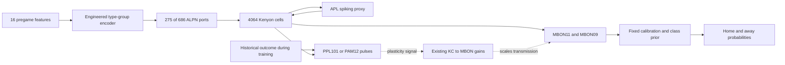

# Circuit and learning-rule contract

This page describes inspected code. It is not a biological validation or a new learning experiment. [Current branch distinction](reassessment.md).



The diagram selects relevant pathways, not the complete graph. The full recurrent network and other inputs to these cells remain. DAN fast transmission is suppressed; the dotted plasticity path is a separately implemented rule. The readout is not a natural motor output. [Circuit constructor](../bet36fly/reward_protocol.py).

## Numerical contract in the main checkout

| Quantity | Schema-3 setting | Meaning |
| --- | --- | --- |
| Integration step | 0.2 ms | Discrete event resolution |
| Membrane / synaptic decay | 20 / 5 ms | Uniform LIF constants |
| Threshold above rest | 7 mV | Rest/reset −52 mV, threshold −45 mV |
| Delay / refractory | 1.8 / 2.2 ms | Sensory ports are exempt from refractory delay |
| Base contact factor | 0.275 mV × global 0.5 | Before target/source gains and learned edge gain |
| Cell gains | ALPN input 0; KC input 1.25; APL output 0.25 | Explicit dynamics interventions |
| Trial / stimulus | 400 / 300 ms | No implied conversion to a real game's time |
| Plasticity onset / reference window | 100 / 50 ms | Reference measured in [50,100) ms |
| Teaching times | 310, 330, 350, 370 ms | Training only |
| Trace time constant | 500 ms | KC and DAN event-history proxy |
| Learning rate / bounds | 0.0005 / [0.5,1.5] | Dimensionless multiplicative edge gains |

Sources: [frozen config](../configs/reward-v3-pilot.json), [native kernel](../bet36fly/reward_lif.cpp). Shiu's reference supplies the LIF foundation on female FlyWire; applying it to MaleCNS with these interventions does not reproduce the reference's sensorimotor experiments. [Shiu paper](https://www.nature.com/articles/s41586-024-07763-9), [inspected implementation](https://github.com/philshiu/Drosophila_brain_model/blob/91bdd1e7dcf193f3e7ca5a8933497fcef63b7960/model.py).

## Event and trace semantics

Let `K[t]` be a particular KC's binary spike event, and `D[t]` the selected DAN population's spikes divided by its cell count in this step. Let `b` be its estimated events-per-cell-per-step reference. The main kernel first decays prior traces, then applies:

```text
D_eff[t] = D[t] - b
delta_gain = eta * (D_trace * K[t] - K_trace * D_eff[t])
gain = clip(gain + delta_gain, lower, upper)
K_trace += K[t]
D_trace += D_eff[t]
```

The trace increments occur after the update. Thus the current event is not already inside the trace on the same step. The traces begin at the declared onset, not at the start of sensory presentation. Each trial resets voltages, synaptic state, pending events and traces; gains persist through the caller. Evaluation disables teaching and updates. [Kernel](../bet36fly/reward_lif.cpp), [wrapper](../bet36fly/reward_brain.py).

Subtraction is signed: if no DAN fires but `b > 0`, `D_eff` is negative. With remaining KC eligibility, the depression term becomes potentiating. This is the demonstrated post-offset artifact, not merely stochastic estimation noise. The [repair kernel snapshot](../docs/evidence/reassessment-2026-09-12/repair-reward_lif.cpp.txt) adds the raw-D option and per-edge eligibility; it is not the kernel imported by this checkout.

## What was borrowed, and what was not

Jiang and Litwin-Kumar use rectified rate signals, low-pass traces, bounded weights and an additional weight-update timescale in a task-optimized recurrent model. Their `runmodel.py` updates plasticity before adding the new trace contribution. BET36FLY borrows the opposing KC/DAN timing terms; its event impulses, normalization, initialization, timescale and surrounding circuit differ. Their optimized generation of DAN signals is not automatically supplied by importing an anatomical graph. [Paper](https://journals.plos.org/ploscompbiol/article?id=10.1371/journal.pcbi.1009205), [inspected source](https://github.com/alitwinkumar/jiang_litwin-kumar_mb_rnn/blob/a16f86a3e9e476eff6860c3c0e0e1bbe729d7f85/runmodel.py).

A synthetic oracle can show that a kernel implements its declared formula. Full-circuit replay can attribute an observed update to its recorded inputs. Neither establishes that the formula teaches a specific association. That requires the [conditioning controls](evidence-gates.md).

[Wiki index](index.md)
